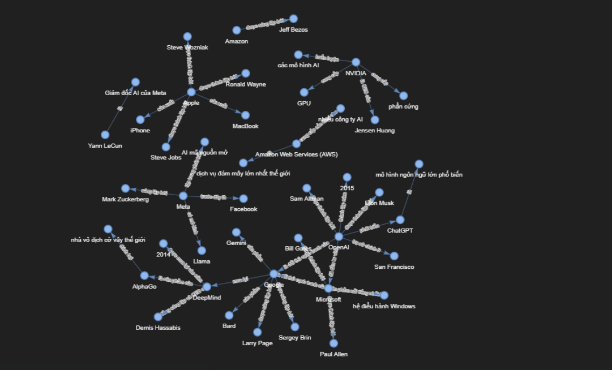

# Lab 19: Xây dựng hệ thống GraphRAG với Tech Company Corpus

Dự án này thực hiện các yêu cầu của Lab 19: Xây dựng một Pipeline GraphRAG, so sánh với Flat RAG truyền thống dựa trên bộ dữ liệu Tech Company Corpus. Dự án tiến hành trích xuất thực thể, xây dựng đồ thị tri thức và so sánh độ hiệu quả của phương pháp GraphRAG với FlatRAG thông qua 20 câu hỏi benchmark.

## 1. Cấu trúc thư mục

```text
.
├── data/
│   └── tech_corpus.txt    # Dữ liệu text chứa thông tin các công ty công nghệ
├── results/               # Thư mục chứa kết quả đánh giá và hình ảnh đồ thị
│   ├── comparison_report.csv
│   ├── graph.html
│   └── graph.png
├── src/
│   ├── config.py          # Cấu hình biến môi trường
│   ├── graph_builder.py   # Module trích xuất thực thể, quan hệ và xây dựng Graph bằng NetworkX
│   ├── flat_rag.py        # Module Flat RAG dùng Vector Database (ChromaDB)
│   ├── graph_rag.py       # Module Graph RAG thực hiện truy vấn trên đồ thị
│   └── evaluation.py      # Module chạy đánh giá 20 câu hỏi
├── main.py                # Script chạy toàn bộ pipeline
├── requirements.txt       # Danh sách thư viện
└── .env                   # File môi trường chứa OPENAI_API_KEY
```

## 2. Cài đặt và Chạy hệ thống

**Bước 1:** Clone repository và di chuyển vào thư mục dự án.

**Bước 2:** Cài đặt các thư viện phụ thuộc:
```bash
pip install -r requirements.txt
```

**Bước 3:** Cấu hình biến môi trường bằng cách đổi tên file `.env.example` thành `.env` và cung cấp `OPENAI_API_KEY`:
```env
OPENAI_API_KEY=your_openai_api_key_here
```

**Bước 4:** Thực thi pipeline:
```bash
python main.py
```
Quá trình chạy sẽ tuần tự thực hiện:
1. Trích xuất thực thể và quan hệ từ corpus để xây dựng đồ thị (GraphRAG).
2. Xây dựng index cho hệ thống FlatRAG.
3. Chạy đánh giá và so sánh kết quả sinh ra bởi 2 phương pháp dựa trên 20 câu hỏi đánh giá.

## 3. Kiến trúc Hệ thống

### 3.1. Entity Extraction và Graph Construction (GraphRAG)
- Sử dụng mô hình LLM của OpenAI để đọc bộ dữ liệu "Tech Company Corpus" và trích xuất thông tin dưới dạng bộ ba (Triples - `Subject, Relation, Object`).
- Sử dụng thư viện **NetworkX** để xây dựng đồ thị từ các bộ ba đã trích xuất, kết hợp với **PyVis** để trực quan hóa đồ thị (`results/graph.html`).

### 3.2. Querying (Truy vấn đa bước)
- Hệ thống trích xuất thực thể từ câu hỏi của người dùng và tìm kiếm node tương ứng trong đồ thị.
- Trích xuất thông tin từ các node lân cận (2-hop) để làm ngữ cảnh gửi cho LLM tổng hợp thành câu trả lời cuối cùng.

### 3.3. So sánh Flat RAG và GraphRAG
- **Flat RAG**: Chunking text và lưu trữ vào Vector Database. Khi query, hệ thống dùng vector similarity search để lấy ngữ cảnh.
- **GraphRAG**: Lấy ngữ cảnh theo mối quan hệ ngữ nghĩa trên đồ thị đã xây dựng.

## 4. Kết quả và Đánh giá (Deliverables)

### 4.1. Đồ thị Tri thức (Knowledge Graph)
Dưới đây là hình ảnh trực quan hóa của Knowledge Graph được xây dựng từ tập dữ liệu công ty công nghệ:


*(Xem đồ thị có thể tương tác đầy đủ tại `results/graph.html`)*

### 4.2. Đánh giá 20 câu hỏi Benchmark
Kết quả đánh giá 20 câu hỏi giữa Flat RAG và GraphRAG được lưu trữ chi tiết trong file `results/comparison_report.csv`. 

**Một số quan sát chính:**
- **Flat RAG:** Có thể gặp hiện tượng ảo giác (hallucination) đối với những câu hỏi phức tạp yêu cầu tổng hợp thông tin từ nhiều nguồn hoặc những câu hỏi yêu cầu multi-hop reasoning (ví dụ: *"Kể tên một số đối thủ cạnh tranh của OpenAI trong lĩnh vực AI"*).
- **GraphRAG:** Cung cấp thông tin chuẩn xác và mang tính liên kết chặt chẽ hơn do tận dụng được cấu trúc topology của mạng lưới. GraphRAG vượt trội ở các câu hỏi liên quan đến mối quan hệ.

### 4.3. Phân tích Chi phí (Cost & Time)
- **Xây dựng Flat RAG:** Thời gian nhanh và tốn ít chi phí API (chủ yếu là chi phí gọi model embedding).
- **Xây dựng GraphRAG:** Đòi hỏi gửi toàn bộ nội dung text qua LLM để trích xuất Triples, dẫn đến tốn nhiều token (chi phí OpenAI API cao hơn) và thời gian thực thi lâu hơn. Tuy nhiên, nó chỉ thực hiện một lần khi lập chỉ mục (Indexing). Thời gian truy vấn thì diễn ra rất nhanh và ngữ cảnh gọn nhẹ hơn so với FlatRAG.
